 

  

<table>
<tr>
<td width="300">
  
</td>
<td>
  <h3><a href="https://github.com/skmaurya12ab">My GitHub Profile</a></h3>
  
https://github.com/skmaurya12ab

  
A short description of what visitors will find on your site.

</td>
</tr>
</table>
